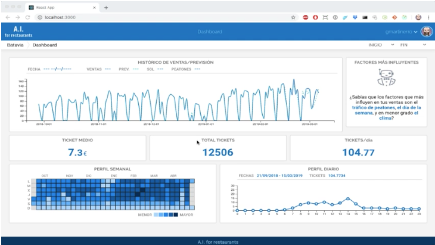

# Jarvis

## Introduction

This project has been conceived as a two-part software package, a front-end client, built with the help of React and D3 libraries and an API to serve some information required by the dashboard in certain circumstances.

This way the project shows the overall structure (somehow simplified) of a final data product that could be used by restaurant owners to improve their businesses and increase sales. The global scope of the project falls out of the scope of the work presented here for KSchool, since many other data is expected to be used to provide more information and intelligence about customers, demographics and their interactions in social networks to imporve the owner's knowledge about their real customer base and status of the business.

Along with the final software product (final in the scope of the master's final work) a small set of notebooks are included to show the actual data science process involved. Many other notebooks and R and python scripts where used, specially in the preliminary exploratory phase, but the lack of quality and clearness of them made them "not worthy" of being included here. Also, some ETL had to be done to get the data right, but the scripts involved are also not relevant and would only increase the overall clutter.

### Notebooks
For the purpose of evaluation, the starting point should be the notebooks. Two folders have been included under the `notebooks` folder:

* `preliminar work` shows a couple of notebooks were some libraries and algorithms were tested. Prophet was one of them, and though it seemed a good idea initially, the chosen solution is a different one.
* `final notebooks` include the notebooks that show the final model used in this work, a exploration done using, again, Prophet, and an aditional work, not included in the final product, to classify the set of online customers by means of ML unsupervised techniques, with the hope of using it after this MFW.

### Client
The client module is described in its own README.md file under the `client` folder. Please refer to it for further information.

### API 
As in the case of the client module, the API folder (`api`) includes its own README.md file to follow instructions.

And lastly, I do really believe that and image is worth a thousand words, so, please **don't forget to watch the video above!**
