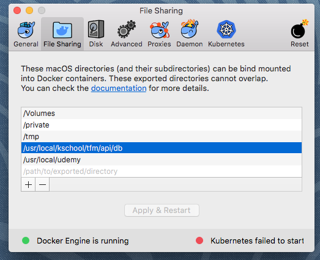

# AI for restaurants API


## Installation 

To install the API you can use any of these two methods:

 1. If you already have a MYSQL server that can be reached from the machine that will run the API, you can make use of it by simply providing a set of environment variables to the _flask_ application before running it. All the data needed for this project to run is under the `db` folder in the form of SQL files that must be executed into the MYSQL server in alphabetical order.
 2. If you do not have a MYSQL server or you just do not want to use it, you can choose the _docker_ option. To take advantage of it, you must have already installed the docker engine in your computer and setup certain privileges to allow the container to access the `db` folder in runtime. Please follow instructions under _Second option: using docker_.
 
 
### First option: providing a MYSQL server
If you choose to use your own MYSQL server, you must follow this instructions:

1. Run the `01-init.sql` and `02-aifrdb.sql` files into your MYSQL server. These files create the _aifrdb_ database that is used by the API.
2. Add the following environment variables to run the flask APP:

|VARIABLE| DEFAULT VALUE |
|---|---|
| MYSQL_HOST | 127.0.0.1 |
| MYSQL_PORT | 3306 |
| MYSQL_USER | root |
| MYSQL_PASSWORD | _empty_ |


> **Alternative method**: If you don't feel like messing around with the environment vars, you can edit the `database.py` file and change the default values used in the `dbConfig` function:
````
def dbConfig():
    server = os.getenv('MYSQL_HOST', '127.0.0.1')
    port = os.getenv('MYSQL_PORT', '3306')
    user = os.getenv('MYSQL_USER', 'root')
    password = os.getenv('MYSQL_PASSWORD', '')
    database = os.getenv('MYSQL_DATABASE', 'aifrdb')
    return {'server': server, 'port': port, 'password': password, 'database': database}

````

#### Python libraries
In order to run the API, please run the following command:
```
pip3 install Flask flask-cors flask-restplus pymysql
```
to install all the required libraries.


### Second option: Using _docker_
This module follows the directions stated in https://medium.com/@shamir.stav_83310/dockerizing-a-flask-mysql-app-with-docker-compose-c4f51d20b40d to build a *docker-compose* file running the services needed to provide an API endpoint for the client to run.

Before running the `docker-compose` file, you must have installed the docker engine ([https://docs.docker.com/install/](https://docs.docker.com/install/)) and the `docker-compose` tool.

#### Gotchas
The docker-compose file makes use of the _host volume_ feature of Docker to access the SQL containing all the data needed by the MYSQL server. Please check the "File Sharing" configuration option to add the `db` folder to the list of folders:




## Running the API

### Providing a MYSQL Server
To run the API, just execute the app.py python file:
```
python app.py
```
...or use the flask run command:
````
flask run
````

### Using Docker
To run the dockerized version of the API, run this command in the `api`directory:
```
docker-compose up
````

##### Cleanup
To free up all the resources used by the docker containers, after testing the API, run the following commands:
```
docker-compose stop
docker-compose rm
docker container prune
docker volume prune
```


