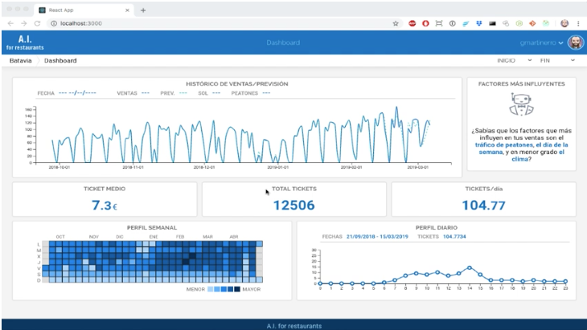

# AI for restaurants-client

[](https://youtu.be/tHlimifU0d0)


> Checkout the explanation video in https://youtu.be/tHlimifU0d0 or click the image above.

There are 3 ways you can test this client:

1. Putting the files contained in the `build` folder in your trusty HTML server (Nginx, Apache) and redirecting your browser to the URL where you put them. You can also use any lightweight server like npm's serve (https://www.npmjs.com/package/serve) or the simple-http-server python module (follow instructions below)
2. Following "REACT APP" instructions below, runing the interface in dev mode. This launches the client app in http://localhost:3000 and expects to find the API running in http://localhost:5000
3. Using docker. There is already a dockerized version of the client tagged as `gmartinerro/aifrdb:localhost` hosted in dockerhub and configured to run along with an API running in http://localhost:5000. So you only have to run the proper docker command to make it work:
```
docker run -d -p 3000:80 gmartinerro/aifr-client:latest
```
And then redirect your browser to http://localhost:3000

# 1. Using the build folder and a lightweight python server
You can server the application locally with the help of the simple-http-server module:
````
pip install simple-http-server
cd build
python -m http.server 
````
And then redirect the browser to  http://localhost:8000


# 2. The react way

This project was bootstrapped with [Create React App](https://github.com/facebook/create-react-app).

## Available Scripts

In the project directory, you can run:

### `npm start`

Runs the app in the development mode.<br>
Open [http://localhost:3000](http://localhost:3000) to view it in the browser.

The page will reload if you make edits.<br>
You will also see any lint errors in the console.

### `npm test`

Launches the test runner in the interactive watch mode.<br>
See the section about [running tests](https://facebook.github.io/create-react-app/docs/running-tests) for more information.

### `npm run build`

Builds the app for production to the `build` folder.<br>
It correctly bundles React in production mode and optimizes the build for the best performance.

The build is minified and the filenames include the hashes.<br>
Your app is ready to be deployed!

See the section about [deployment](https://facebook.github.io/create-react-app/docs/deployment) for more information.

### `npm run eject`

**Note: this is a one-way operation. Once you `eject`, you can’t go back!**

If you aren’t satisfied with the build tool and configuration choices, you can `eject` at any time. This command will remove the single build dependency from your project.

Instead, it will copy all the configuration files and the transitive dependencies (Webpack, Babel, ESLint, etc) right into your project so you have full control over them. All of the commands except `eject` will still work, but they will point to the copied scripts so you can tweak them. At this point you’re on your own.

You don’t have to ever use `eject`. The curated feature set is suitable for small and middle deployments, and you shouldn’t feel obligated to use this feature. However we understand that this tool wouldn’t be useful if you couldn’t customize it when you are ready for it.

## Learn More

You can learn more in the [Create React App documentation](https://facebook.github.io/create-react-app/docs/getting-started).

To learn React, check out the [React documentation](https://reactjs.org/).

### Code Splitting

This section has moved here: https://facebook.github.io/create-react-app/docs/code-splitting

### Analyzing the Bundle Size

This section has moved here: https://facebook.github.io/create-react-app/docs/analyzing-the-bundle-size

### Making a Progressive Web App

This section has moved here: https://facebook.github.io/create-react-app/docs/making-a-progressive-web-app

### Advanced Configuration

This section has moved here: https://facebook.github.io/create-react-app/docs/advanced-configuration

### Deployment

This section has moved here: https://facebook.github.io/create-react-app/docs/deployment

### `npm run build` fails to minify

This section has moved here: https://facebook.github.io/create-react-app/docs/troubleshooting#npm-run-build-fails-to-minify
